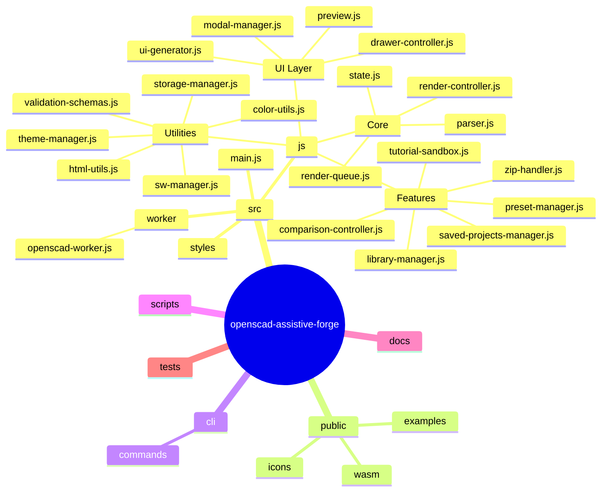
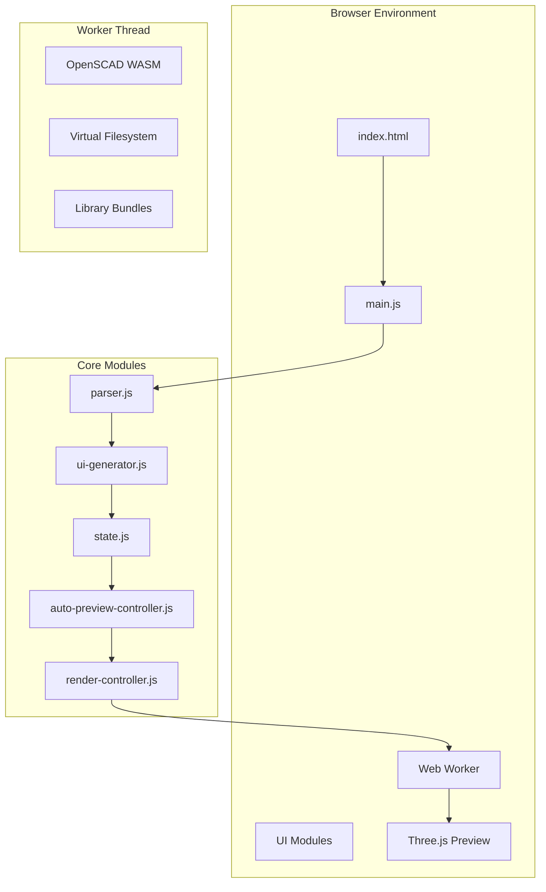
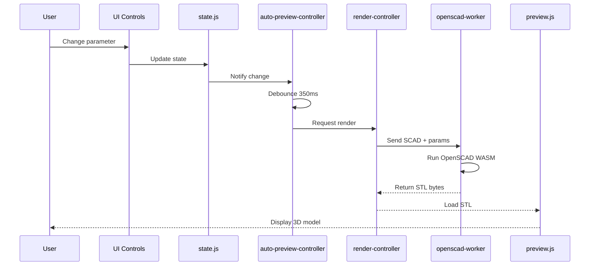
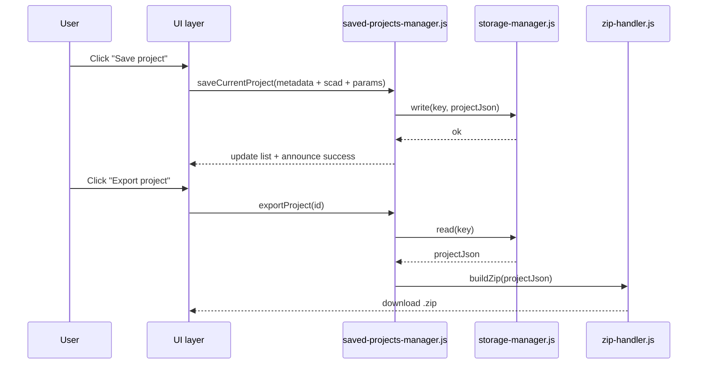
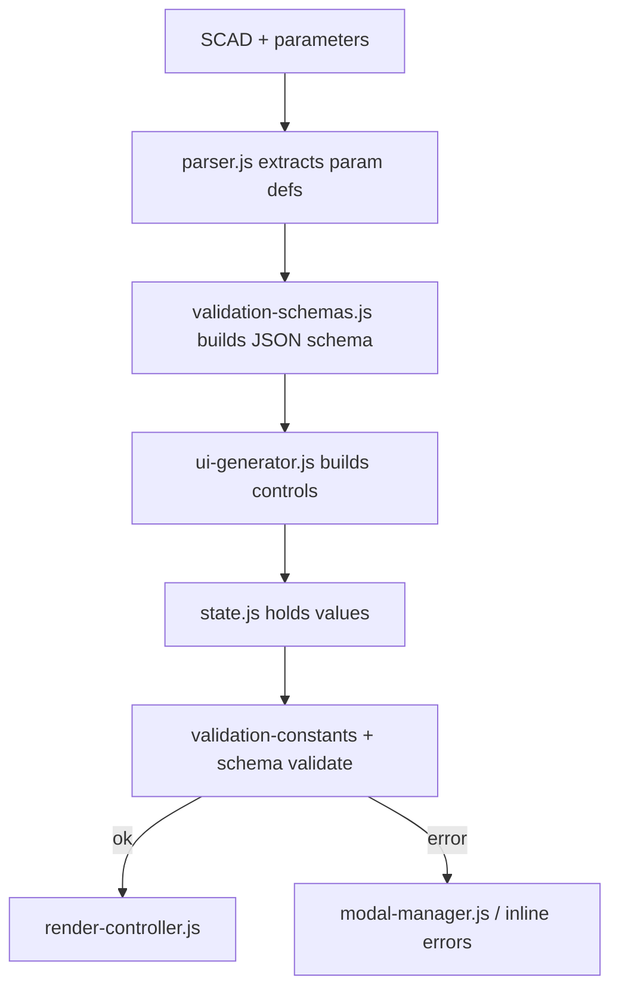
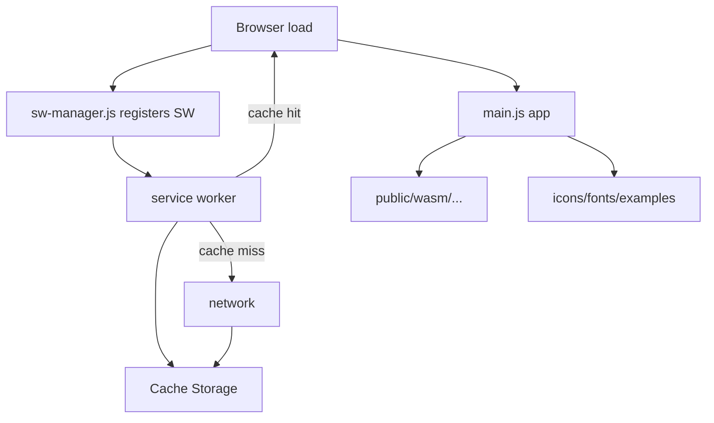
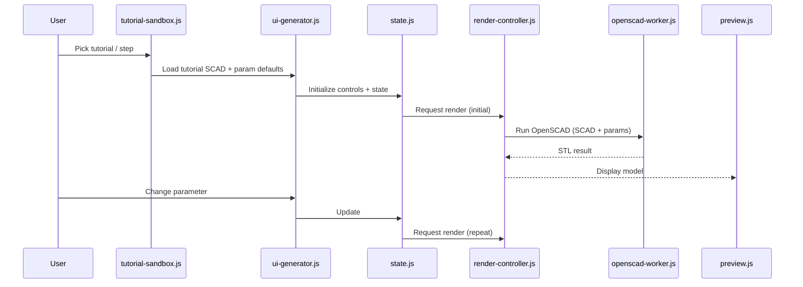
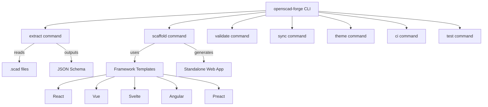

# Architecture

This document describes how the major pieces of the codebase fit together. If you're new to the project, start here to build a mental model.

## High-level overview

OpenSCAD Assistive Forge is a browser-only application. There's no backend. Everything runs client-side:

- OpenSCAD WASM runs in a Web Worker so the UI stays responsive
- Three.js renders the 3D preview
- localStorage stores presets, projects, and preferences
- Service worker caches assets for offline use

The main flow: user uploads a `.scad` file, the parser extracts Customizer annotations, the UI generator builds controls, the user tweaks parameters, the worker renders OpenSCAD, and Three.js displays the result.

## Module map



## Component flow



## Render pipeline

When a user changes a parameter:



The debounce (350ms by default) prevents a render storm when dragging sliders.

## Saved projects

Users can save projects to localStorage and export them as ZIP files:



## Validation flow

Parameters are validated against JSON schemas built from Customizer annotations:



## Service worker and caching



After first load, static assets and WASM are cached for offline use.

## Tutorial sandbox

The tutorial system loads example SCAD files and guides users through parameter changes:



## Comparison mode

Side-by-side rendering with shared controls:

```mermaid
flowchart LR
    UI[comparison-view.js / comparison-controller.js] --> State[state.js]
    State --> RenderA[render-controller (A)]
    State --> RenderB[render-controller (B)]
    RenderA --> Worker[openscad-worker.js]
    RenderB --> Worker
    RenderA --> PreviewA[preview.js (left)]
    RenderB --> PreviewB[preview.js (right)]
    UI -->|toggle / swap / sync| State
```

## CLI tool

The CLI (`openscad-forge`) is for developers who want to extract parameters or scaffold standalone customizers:



## Key modules

**Entry point:**
- `src/main.js` - app initialization, event wiring, UI orchestration

**Core logic:**
- `src/js/parser.js` - extracts Customizer annotations from SCAD
- `src/js/state.js` - holds current parameter values
- `src/js/render-controller.js` - queues and dispatches renders
- `src/js/render-queue.js` - manages render queue and caching
- `src/js/auto-preview-controller.js` - debounces parameter changes

**UI layer:**
- `src/js/ui-generator.js` - builds form controls from parsed params
- `src/js/preview.js` - Three.js 3D preview
- `src/js/modal-manager.js` - modal dialogs
- `src/js/drawer-controller.js` - drawer/panel behavior

**Features:**
- `src/js/preset-manager.js` - save/load parameter presets
- `src/js/saved-projects-manager.js` - save/load full projects
- `src/js/comparison-controller.js` - side-by-side mode
- `src/js/zip-handler.js` - ZIP extraction and creation
- `src/js/library-manager.js` - OpenSCAD library bundles
- `src/js/tutorial-sandbox.js` - guided tutorials

**Utilities:**
- `src/js/storage-manager.js` - localStorage wrapper
- `src/js/theme-manager.js` - light/dark/high-contrast themes
- `src/js/validation-schemas.js` - JSON schema generation
- `src/js/sw-manager.js` - service worker registration
- `src/js/color-utils.js` - color parsing/validation
- `src/js/html-utils.js` - HTML escaping, security utilities

**Worker:**
- `src/worker/openscad-worker.js` - runs OpenSCAD WASM in isolation
