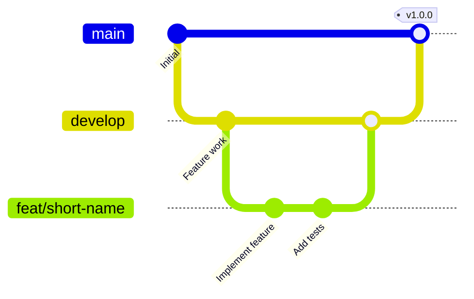

# Development workflow

This is a one-maintainer repo. The goal is “easy to review, hard to break”.

## Branches

- Work from `develop`.
- Open PRs back into `develop`.
- `main` is for releases / production only.



The `main` branch is what's deployed to production. All development happens on `develop`.

## Typical loop

```bash
git checkout develop
git pull
git checkout -b feat/short-name

npm install
npm run dev
```

Before you open a PR:

```bash
npm run test:run
npm run test:e2e
npm run lint
npm run format
```

## Commit messages

Keep them boring:

- `feat: ...`
- `fix: ...`
- `docs: ...`
- `test: ...`
- `chore: ...`

## PRs

Small PRs land. Huge PRs usually stall.

If you changed UI:

- Keyboard-only pass
- Light/dark/high-contrast pass
- Screen reader sanity-check if you can
